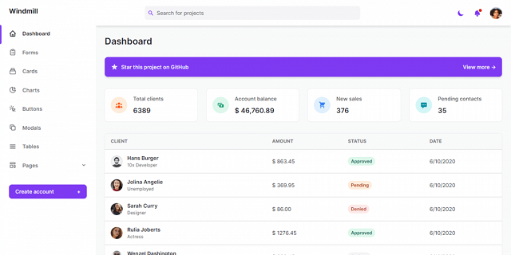

# DESKTR

Book Sales & Distribution Management Software

[](https://laravel.com/docs/8.x)
[](https://www.w3schools.com/php/default.asp)
[](https://www.w3schools.com/mysql/default.asp)

## Installation
```bash
$ composer create-project laravel/laravel:^8.0 DESKTR

$ cd DESKTR

$ php artisan serve
```

> Local: http://localhost:8000/

## Setup
```bash
$ git clone https://github.com/2gbeh/DESKTR.git

$ cd DESKTR

$ composer install

$ npm install (optional)

$ php artisan key:generate

$ php artisan serve
```

> Local: http://localhost:8000/

## Usage
1. Start `Apache Server` and visit [http://localhost/phpmyadmin](http://localhost/phpmyadmin/)

2. Create a new database `desktr`

3. Import database dump [desktr.sql](./database/desktr.sql)

4. Copy `.env.example` to `.env` and update content where applicable

```
APP_DEBUG=true
DB_USERNAME=${database_username}
DB_PASSWORD=${database_password}
```

5. Visit http://127.0.0.1:8000

## Screenshots


## Resources
* [Laravel Installation](https://laravel.com/docs/master/installation#via-composer-create-project)

* [Upload Laravel Project On GitHub - Web Tech Knowledge](https://youtu.be/X40b9x9BFGo?si=hZJw1vYleCkyAVVG)

* [30 Days to Learn Laravel - Laracasts](https://www.youtube.com/watch?v=1NjOWtQ7S2o&list=PL3VM-unCzF8hy47mt9-chowaHNjfkuEVz)